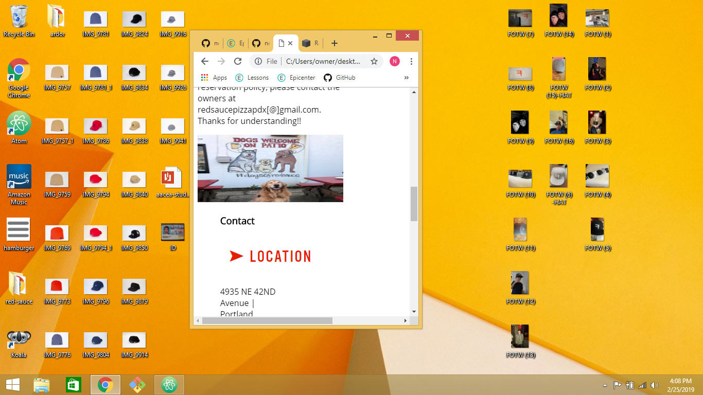

## Red Sauce Clone
---

#### Nelia Terrazas
#### Date of Completion

### Description

This project is to show my knowledge of flexbox and media queries.

#### Desktop Version

#### Mobile Version

### Technologies and Resources

* Flexbox
* HTML
* CSS

### Responsiveness

There are two versions of the site: one for desktop and one for mobile.

### Setup Instructions

Download/Clone this repository at: https://github.com/neliaterrazas/red-sauce.git
Open in your preferred text editor of browser.

### Roadmap

* Futher polishing of mobile version.

### License

MIT License.

Copyright (c) 2018 **_Nelia Terrazas_**
